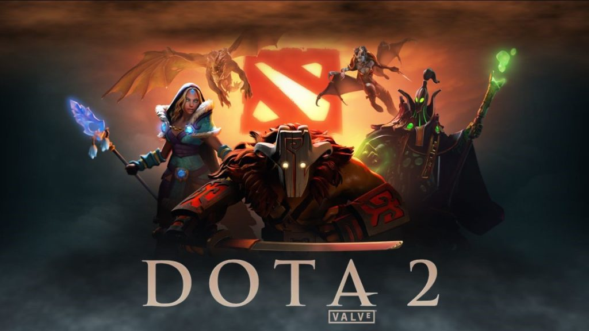
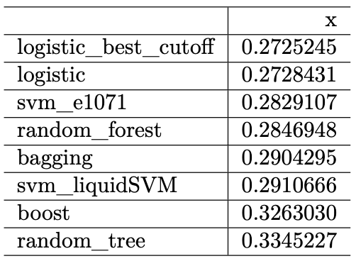

# ML Project: Predict Dota 2 Game Outcome
This is my personal machine learning project. The goal of the project is to predict the outcome of dota2 game.

# Introduction

_Dota 2_ is a famous video game with a large esports scene in the world. _Dota 2_ has an annual esports world championship tournament with over $34 million US dollars prize pool in the recent one. The ability to predict the out come of a specific game is extremely crucial not only in the sports tournament but also in regular game pubs. Knowing the winning factor of game will help player to analyze the game and strategy. 

# Data
## Data overview
The data set comes from a public [_kaggle competition_](https://www.kaggle.com/c/mlcourse-dota2-win-prediction/overview). This competition is organized by [_mlcourse.ai_](mlcourse.ai) in collaboration with [_GOSU.AI_](GOSU.AI) which is a company specialized using artificial intelligence to help player improve skills and strategies. The publisher already provides `train_features.csv` and `test_features.csv` sets as training and test data sets. However since this is a kaggle competition, the true result of the `test_features.csv` set is not released at this point. Therefore I will create my own test sets from the `train_features.csv` set. The `train_targes.csv` data set is the results for games from the training set, _i.e._ whether team Radiant eventually won. I will combine two data sets for easier data manipulation. The descriptive variable we are interested in is `radiant_win` which indicates `True` or `False`. Now we create our own dataframe by combining data sets. 

## Variables overview
Here is the short list of definitions of explanatory variables that I am going to use in my analysis:

* `towers_killed`: number of enemy team's towers killed
* `K/D/A`: kills, deaths, assists
* `lh`: last hits, number of enemy creeps killed
* `denies`: number of friendly creeps killed to deny enemy's gold and experience
* `gold`: gold player earned
* `xp`: player's experience
* `level`: player's level
* `stuns`: total duration of stun, which immobilize enemy players
* `firstblood`: first player to complete a kill, which has better gold rewards
* `obs_placed`, `sen_placed`: the number of observation and sentry wards placed by a player

# Machine Learning
The project implemented the following ML algorithms:

* Logistic Regression
* Random Forests
* Support Vector Machine (SVM)

# Conclusion

# Study Limitations
First, since R stores all its objects in memory, the size of the dataset limits the training probabilities. Even with 16GB of RAM, training models still takes several minutes, especially for complex methods such as random forests and SVM. The execution speed of algorithms is crucial espesically in production. If applying those ML algorithms in a real-time winning predicting AI, the speed should be as fast as possible. Therefore the limitation of computational power prohibits better tuning and production ability of the model. With cloud computing service such as Google Cloud and AWS, I believe algorithms like SVM, neural networks and deep learning will perform better.  

Second, this machine learning project did not focus too much on outliers. As the box plot showed before, there exists a significant amount of outliers. It makes sense because there are a lot of uncertainties in an online game. A team can win even with no towers standing and low kills. Turnovers are very common in _Dota2_ games. It happens when enemy team making a fatal mistake or a player is throwing in the game. Methods like logistic regression are more sensitive to outliers while tree based methods are more robust. Therefore if outliers are dealt with properly, these machine learning algorithms will idealy perform better.
