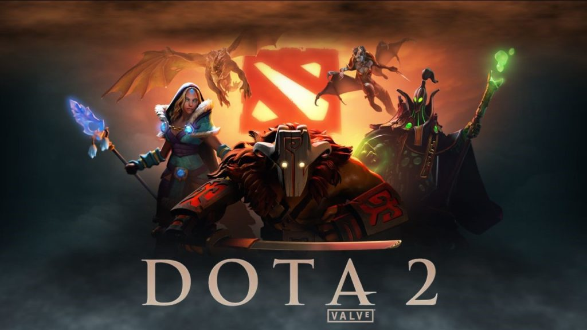

```{r setup, warning=FALSE, message=FALSE}
library(tidyverse)
library(dplyr)
library(caret)
library(ggplot2)
library(ROCR)
library(e1071)
library(liquidSVM)
library(rpart.plot)
library(randomForest)
library(gbm)
library(knitr)
library(kableExtra)
library(ggpubr)
```




# Introduction
_Dota 2_ is a MOBA (Multiple Online Battle Arena) game developed by Valve which is a sequel to the popular game _Defense Of the Ancients (DotA)_. There are two teams in the game- Radiant and Dire where each team contains 5 players. For each game every player will pick a hero. The map with three lanes is  separated diagonally into two parts by a river. The goal of the game is to defend the ancient and take down enemy's ancient.  

```{r echo=FALSE}
img = png::readPNG("dota2_map.png")
grid::grid.raster(img)
```


_Dota 2_ is a famous video game with a large esports scene in the world. _Dota 2_ has an annual esports world championship tournament with over $34 million US dollars prize pool in the recent one. The ability to predict the out come of a specific game is extremely crucial not only in the sports tournament but also in regular game pubs. Knowing the winning factor of game will help player to analyze the game and strategy. 


# Data
## Data overview
The data set comes from a public [_kaggle competition_](https://www.kaggle.com/c/mlcourse-dota2-win-prediction/overview). This competition is organized by [_mlcourse.ai_](mlcourse.ai) in collaboration with [_GOSU.AI_](GOSU.AI) which is a company specialized using artificial intelligence to help player improve skills and strategies. The publisher already provides `train_features.csv` and `test_features.csv` sets as training and test data sets. However since this is a kaggle competition, the true result of the `test_features.csv` set is not released at this point. Therefore I will create my own test sets from the `train_features.csv` set. The `train_targes.csv` data set is the results for games from the training set, _i.e._ whether team Radiant eventually won. I will combine two data sets for easier data manipulation.

```{r cache=TRUE}
#Load the Data
features <- read.csv('train_features.csv')
targets <- read.csv('train_targets.csv')
```

The descriptive variable we are interested in is `radiant_win` which indicates `True` or `False`. Now we create our own dataframe by combining data sets.
```{r, message=FALSE, warning=FALSE}
#Combine two data sets
win <- targets %>% dplyr::select(match_id_hash, radiant_win)
df <- left_join(features, win, by = 'match_id_hash')
#Rearrange 
df <- df %>%
  dplyr::select(match_id_hash, radiant_win, everything())
head(df)[1:10]
```

Now check the dimension and existence of missing values.  The data set has $39675$ rows and $247$ columns. The data sets have $437$ missing values. I will drop missing values first because it will interfere with my logistic regression model.

```{r}
#check dimension
dim(df)
#check missing value
table(is.na(df))
df = drop_na(df)
```

Before splitting my dataset into training and test sets, I will first do some exploratory analysis. Lets first see the distribution of our response variable `radiant_win`. Surprisingly, Radiant have a slightly higher win rate at $52.5\%$ than Dire at $47.5\%$.

```{r}
rad_win_rate <- 100*table(df$radiant_win)['True']/length(df$radiant_win)
dire_win_rate <- 100*table(df$radiant_win)['False']/length(df$radiant_win)
rad_win_rate
dire_win_rate
```

Here is the short list of definitions of explanatory variables that I am going to use in my analysis:

* `towers_killed`: number of enemy team's towers killed
* `K/D/A`: kills, deaths, assists
* `lh`: last hits, number of enemy creeps killed
* `denies`: number of friendly creeps killed to deny enemy's gold and experience
* `gold`: gold player earned
* `xp`: player's experience
* `level`: player's level
* `stuns`: total duration of stun, which immobilize enemy players
* `firstblood`: first player to complete a kill, which has better gold rewards
* `obs_placed`, `sen_placed`: the number of observation and sentry wards placed by a player

## Data Preparation

Since there are total 246 variables in the data set, I will select and combine some columns to reduce the number of predictors. For example, each row has data for 10 players in the game. I will take sum of the same stat as a team to reduce size. First I will separate data sets into two subsets: `rad` and `dire`, which stands for two teams. Then I will sum up each player's stats to team stats. Then I will drop some variables irrelevant to the analysis and combine data sets.

```{r}
#Radiant data set
rad <- df[8:127 ]
names(rad) = paste('r', substring(names(rad), 4), sep='_')
rad_sum = as.data.frame(sapply(split.default(rad, colnames(rad)), rowSums))
#Dire data set
dire = df[128:247]
names(dire) = paste('d', substring(names(dire), 4), sep='_')
dire_sum = as.data.frame(sapply(split.default(dire, colnames(dire)), rowSums))
#Combine data set
df = cbind(df[1:7],rad_sum,dire_sum)
#Drop irrelevant variables
df = df %>%
  dplyr::select(-c(match_id_hash,game_mode, lobby_type,objectives_len,
            chat_len,r_health,r_hero_id,
            r_max_health,r_max_mana,r_x,r_y,d_health,d_hero_id,
            d_max_health,d_max_mana,d_x,d_y))

df$radiant_win = as.factor(ifelse(df$radiant_win == 'True', 'Yes','No'))
```

Split training and test sets.
```{R}
set.seed(1)
train_samples <- df$radiant_win%>%
  createDataPartition(p = 0.6, list=FALSE)
train <- df[train_samples, ]
test <- df[-train_samples, ]
```

Check summary of data types
```{r}
table(sapply(df, class))
```

Let's do some preliminary exploratory analysis plotting. I pick following three variables as I believe these are the important winning factors in _Dota_ game.
```{r}
p1= ggplot(df,aes(y=r_towers_killed,x=radiant_win))+geom_boxplot()
p2=ggplot(df,aes(y=r_gold,x=radiant_win))+geom_boxplot()
p3= ggplot(df,aes(y=r_kills,x=radiant_win))+geom_boxplot()
ggarrange(p1,p2,p3,ncol=3,nrow=1)
```
From the boxplots of `gold` and `kills` versus `radiant_win`, we can tell there are significant amount of outliers. We should be aware of these in future analysis.

# Apply Machine Learning Models
## Logistic Regression
First we construct a simple logistic regression model using default threshold $0.5$ to get a preliminary confusion matrix and test error.
```{r}
set.seed(2)
logit_fit = glm(radiant_win~., data=test, family="binomial")
logit_pred = predict(logit_fit, test, type="response")
predWin = as.factor(ifelse(logit_pred <= 0.5, 'No','Yes'))
#Confusion Matrix
logit_cm = table(predWin, true=test$radiant_win)
logit_cm
#test error
logit_e = 1-sum(diag(logit_cm))/sum(logit_cm)
logit_e
```
Next we will use ROC and AUC to determine best threshold value.

```{r}
#Fit ROC
pred = prediction(logit_pred, ifelse(test$radiant_win == 'Yes',1,0))
perf = performance(pred, measure="tpr", x.measure="fpr")
plot(perf,col=2,lwd=3, main="ROC Curve")
abline(0,1)
auc = performance(pred, "auc")@y.values
auc
# FPR
fpr = performance(pred, "fpr")@y.values[[1]]
cutoff = performance(pred, "fpr")@x.values[[1]]
# FNR
fnr = performance(pred,"fnr")@y.values[[1]]
# Plot
matplot(cutoff, cbind(fpr,fnr), type="l",lwd=2, xlab="Threshold",ylab="Error Rate")
# Add legend to the plot
legend(0.3, 1, legend=c("False Positive Rate","False Negative Rate"),
       col=c(1,2), lty=c(1,2))
rate = as.data.frame(cbind(Cutoff=cutoff, FPR=fpr, FNR=fnr))
rate$distance = sqrt((rate[,2])^2+(rate[,3])^2)
index = which.min(rate$distance)
best = rate$Cutoff[index]
#Best threshold value
best
abline(v=best, col=3, lty=3, lwd=3)
```

Then we build a new logistic model with new threshold value and compare results with the previous model.

```{r}
#Choose new threshold value
logit_pred_best = as.factor(ifelse(logit_pred <=best,'No','Yes'))
logit_cm_best = table(pred = logit_pred_best, test$radiant_win)
#Confusion Matrix
logit_cm_best
#Test error
logit_best_e = 1-sum(diag(logit_cm_best))/sum(logit_cm_best)
logit_best_e
```
The test error is slightly better than default `p=0.5` threshold value.

## Random Forests

Before fitting Random Forests algorithm, we will first grow a single Random Tree. Random Tree is recognized as a classification algorithm that is easy to interprete.

```{r}
set.seed(4)
tree = rpart(radiant_win~., data=train, method="class")
rpart.plot(tree)
#Confusion Matrix
tree_pred = predict(tree, test, type="class")
tree_cm = table(tree_pred, test$radiant_win)
#Test error
tree_e = 1-sum(diag(tree_cm))/ sum(tree_cm)
tree_e
```

As expected, random tree performs poorly with $33.4\%$ error rate on test set. This is because Random Tree tends to overfit on training data therfore it will have a higher variance. However the graph of tree provides some useful insights. The tree splits at `towers_killed`, `kills`, `deaths` which are very important game factors. The tree splits first with number of towers killed making perfect sense because the team with no defending towers left are most likely losing. We will then perform cross validation to find the best `cp` value to prune the tree.
```{r}
#CP Plot
plotcp(tree)
bestcp = tree$cptable[which.min(tree$cptable[,"xerror"]),"CP"]
pruned_tree = prune(tree,cp=bestcp)
rpart.plot(pruned_tree)
```
It turns out that the tree is the same before and after pruning. Next we will use bagging.

```{r cache=TRUE}
#m=p
set.seed(5)
bag = randomForest(radiant_win~., train, mtry =ncol(train)-1,importance=T)
bag_pred = predict(bag, test, type="response")
#Confusion Matrix
bag_cm = table(bag_pred, true = test$radiant_win)
bag_cm
#Test error
bag_e = 1-sum(diag(bag_cm))/sum(bag_cm)
bag_e
```
Next we apply random forests to our data. We will use the default value $mtry = \sqrt{p}$ and grow $5000$ trees.
```{r cache=TRUE}
#Random Forest model
set.seed(6)
rf = randomForest(radiant_win~., train, mtry = sqrt(ncol(train)-1),
                  importance=T,ntree=5000)
plot(rf)
varImpPlot(rf,n.var=10, main="Variable Importance Plot")
rf_pred = predict(rf, test, type="response")
rf_cm = table(pred = rf_pred, true=test$radiant_win)
rf_cm
#Test error
rf_e = 1-sum(diag(rf_cm))/sum(rf_cm)
rf_e
```
From the error vs trees plot we can see that the error decreases while number of trees grown increases. The variable importance plot clearly showed the most important 10 variables. The `gold` for both teams are listed as the top 2 important variables. The Random Forest classifier also performs significantly better than single Random Tree.*

```{r cache=TRUE}
set.seed(7)
boost = gbm(ifelse(radiant_win=='Yes',1,0)~., data=train,
                   distribution = "bernoulli",
            n.trees=5000, interaction.depth = 6)
summary(boost,cBars=15)
boost_pred = ifelse(predict(boost, test, n.trees=5000) >=0.5,'Yes','No')
boost_cm = table(pred = boost_pred, true = test$radiant_win)
boost_cm
#Test Error
boost_e = 1-sum(diag(boost_cm))/sum(boost_cm)
boost_e
```
The boosted model performs better than Random Tree but worse than Random Forest

## Support Vector Machine
Lastly, I will apply the SVM model. I will compare results from `svm` functions from `e1071` and `liquidSVM` package. I will set `kernal="polynomial"` and `cost=1`.
```{r cache=TRUE}
set.seed(8)
#Using SVM from LiquidSVM package
svmfit = mcSVM(radiant_win~., train, scale=TRUE, gpus=1)
svm_pred = predict(svmfit,test, type="response")
svm_cm = table(pred=svm_pred, true=test$radiant_win)
svm_cm
svm_e = 1- sum(diag(svm_cm)) /sum(svm_cm)
svm_e
#Using SVM from e1071 package
set.seed(9)
svmfit2 = e1071::svm(radiant_win~., train, kernal="polynomial",cost=1)
svm_pred2 = predict(svmfit2,test, type="response")
svm_cm2 = table(pred=svm_pred2, true=test$radiant_win)
svm_cm2
svm_e2 = 1- sum(diag(svm_cm2)) /sum(svm_cm2)
svm_e2
```
The `svm` function in `e1071` gives lower test error than `mcSVM` in `liquidSVM` package. However, `liquidSVM` package is significantly faster than `e1071` package. This is crucial in production. Considering the size of the data set and limitation of computational power, it is not time efficient to run `tune` function to find the best `cost` value. Therefore we will keep using the default hyperparameters.

# Conclusion
## Final model
Comparing the test errors of all the models, the final model with lowest error is logistic regression with threshold set to $0.5325936$. Here is a table of all the test errors:

```{r}
test_error = data.frame(logistic = logit_e, logistic_best_cutoff = logit_best_e, random_tree = tree_e, bagging=bag_e, random_forest=rf_e,boost=boost_e, svm_liquidSVM=svm_e,svm_e1071=svm_e2)
test_error = t(test_error)
test_error = test_error[order(test_error),]
test_error %>%
  kable()%>%
  kable_styling()
```

## Study limitations

First, since R stores all its objects in memory, the size of the dataset limits the training probabilities. Even with 16GB of RAM, training models still takes several minutes, especially for complex methods such as random forests and SVM. The execution speed of algorithms is crucial espesically in production. If applying those ML algorithms in a real-time winning predicting AI, the speed should be as fast as possible. Therefore the limitation of computational power prohibits better tuning and production ability of the model. With cloud computing service such as Google Cloud and AWS, I believe algorithms like SVM, neural networks and deep learning will perform better.  

Second, this machine learning project did not focus too much on outliers. As the box plot showed before, there exists a significant amount of outliers. It makes sense because there are a lot of uncertainties in an online game. A team can win even with no towers standing and low kills. Turnovers are very common in _Dota2_ games. It happens when enemy team making a fatal mistake or a player is throwing in the game. Methods like logistic regression are more sensitive to outliers while tree based methods are more robust. Therefore if outliers are dealt with properly, these machine learning algorithms will idealy perform better.

# References
data source: https://www.kaggle.com/c/mlcourse-dota2-win-prediction/overview


